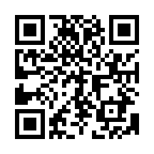

# Secure Boot Recovery
#### English
This tool fixes Windows Secure Boot Violation errors.

While a functional Windows environment is typically required, you can also create the recovery media on other platforms.
To create a bootable drive, simply copy the files and their directory structure to a **FAT32-formatted** flash drive.

#### 日本語
Windows で Secure Boot Violation が発生する状態を修正します。

本来は Windows が通常起動する環境が必須ですが、他のプラットフォームからでもセキュアブートの問題を解決するための USB メモリを作成することができます。
**FAT32 でフォーマット**した USB メモリにファイルをディレクトリごとコピーすればブータブルが作成可能です。

#### Shortcut
Scan the QR code or enter the short URL to access the repository.

QR コードをスキャンまたは短縮 URL を入力でこのリポジトリにアクセスできます。

**QR Code**

**URL**

- https://x.gd/rhbb6
- https://0.gp/50rfq64r
- https://kuku.lu/s3c3068
- https://is.gd/82qnRa

